```html
<div class="parent" style="background-color: yellow;">
    <div class="children" style="background-color: red;">11</div>
    <div class="children" style="background-color: red;">22</div>
    <div class="children" style="background-color: red;">33</div>
</div>
<br>
<div class="parent" style="background-color: yellow;">
    <span class="children" style="background-color: red;">11</span>
    <span class="children" style="background-color: red;">22</span>
    <span class="children" style="background-color: red;">33</span>
</div>
```

# 0. 关于 `line-height`

适合单块级元素和多行内元素

```css
.parent {
    height: 100px;
    line-height: 100px;
}
```

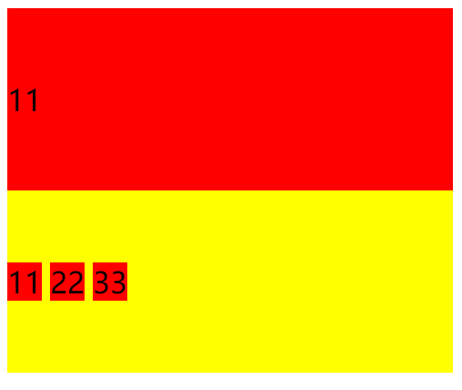


# 多个子元素

## 3. 块级和行内

（1）flex

```css
.parent {
    height: 100px;
    display: flex;
    flex-direction: column;
    justify-content: center;
}
```

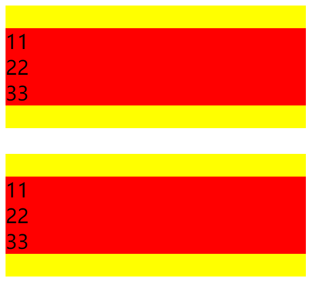


```css
.parent {
    height: 100px;
    display: flex;
    justify-content: center;
}
```

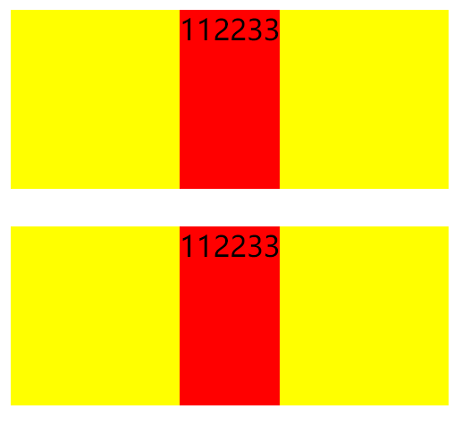

```css
.parent {
    height: 100px;
    display: flex;
}
.children {
    margin: auto 0;
}
```

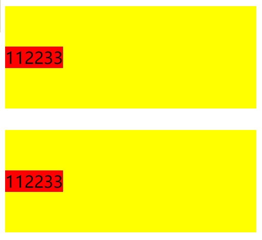

```css
.parent {
    height: 100px;
    display:flex;
    align-items:center;
}
```

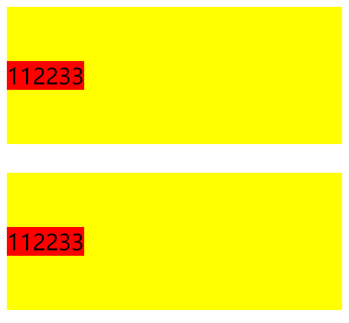


（2）

```css
.parent {
	height: 100px;
	display: table;
}
.children {
	display: table-cell;
	vertical-align: middle;
}
```

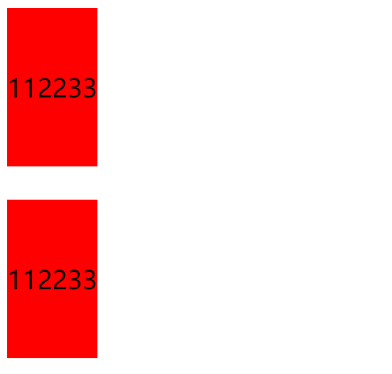

```css
.parent {
    height: 100px;
    display: table-cell;
    vertical-align: middle;
}
```

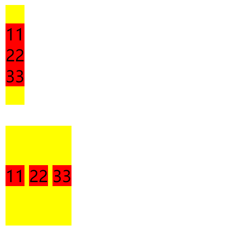

（3）

```css
.parent {
    height: 100px;
}

.parent::after, .children{
  display:inline-block;
  vertical-align:middle;
}
.parent::after{
  content:'';
  height:100%;
}
```

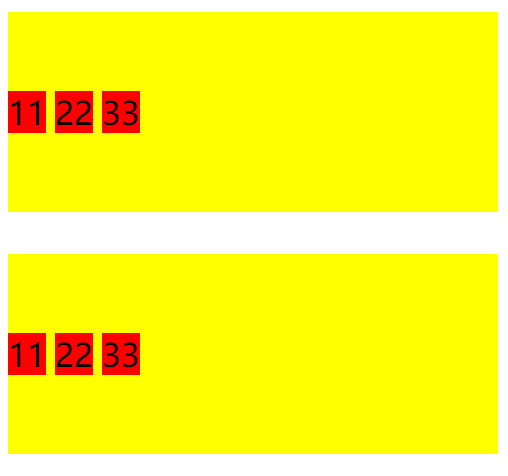


# 单个子元素

## 3. 块级和行内

（1）

```css
.parent {
    position: relative;
    height: 100px;
}
.children {
    position: absolute;
    top: 50%;
    transform: translateY(-50%);
}
```

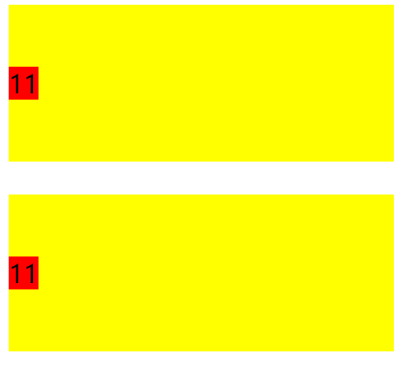


```css
.parent {
    position: relative;
    height: 100px;
}
.children {
    position: absolute;
    top: 50%;
    height: 50px;
    margin-top: -25px;
}
```

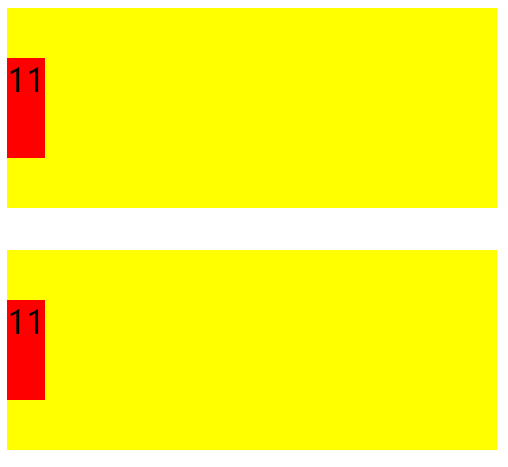

```css
.parent {
    position: relative;
    height: 100px;
}
.children {
    position: absolute;
    top: 0;
    bottom: 0;
    margin: auto 0;
    height: 50px;
}
```

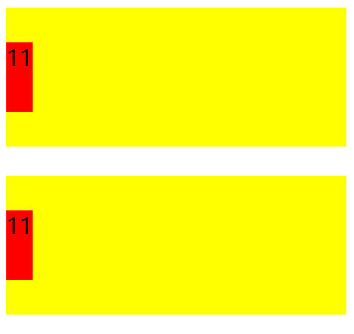
