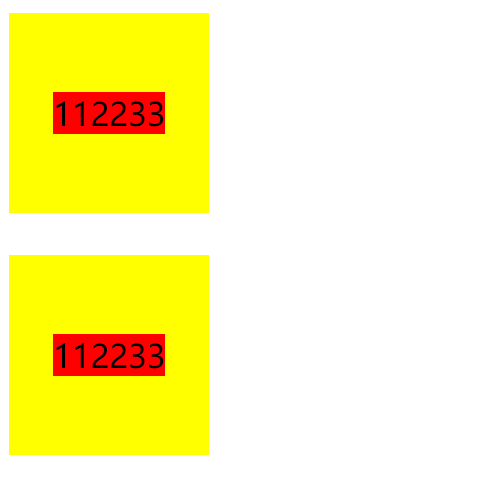
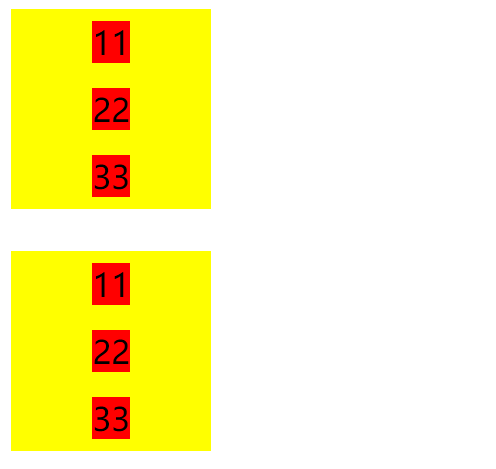
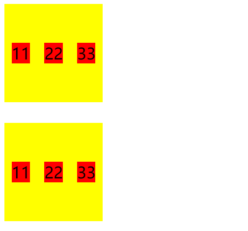
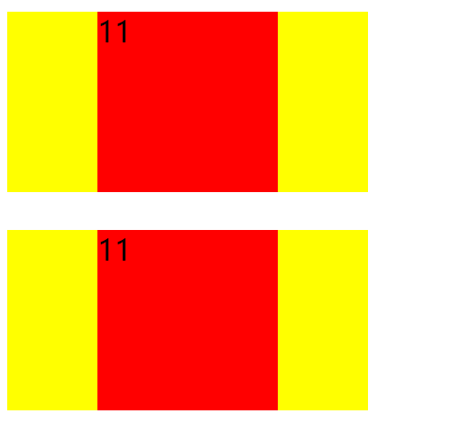
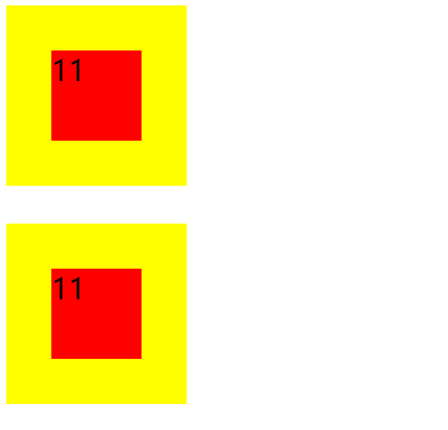
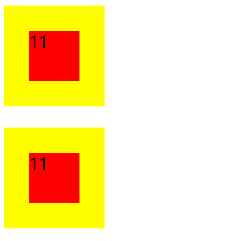

```html
<div class="parent" style="background-color: yellow;">
    <div class="children" style="background-color: red;">11</div>
    <div class="children" style="background-color: red;">22</div>
    <div class="children" style="background-color: red;">33</div>
</div>
<br>
<div class="parent" style="background-color: yellow;">
    <span class="children" style="background-color: red;">11</span>
    <span class="children" style="background-color: red;">22</span>
    <span class="children" style="background-color: red;">33</span>
</div>
```

# 多个子元素

## 3. 块级和行内

（1）

```css
.parent {
    height: 100px;
    width: 100px;
    display: flex;
    justify-content: center;
    align-items: center;
}
```



（2）

```css
.parent {
    height: 100px;
    width: 100px;
    display: grid;
}

.children {
    margin: auto;
}
```



```css
.parent {
    height: 100px;
    width: 100px;
    display: flex;
}

.children {
    margin: auto;
}
```




# 单个子元素

## 3. 块级和行内

（1）

```css
.parent {
    position: relative;
    height: 100px;
    width: 200px;
}
.children {
    position: absolute;
    top: 50%;
    left: 50%;
    margin: -50px 0 0 -50px;
    width: 100px;
    height: 100px;
}
```




```css
.parent {
    position: relative;
    height: 100px;
    width: 100px;
}
.children {
    position: absolute;
    top: 50%;
    left: 50%;
    width: 50px;
    height: 50px;
    transform: translate(-50%, -50%);
}
```



```css
.parent {
    position: relative;
    height: 100px;
    width: 100px;
}
.children {
    position: absolute;
    width: 50px;
    height: 50px;
    top: 0;
    left: 0;
    right: 0;
    bottom: 0;
    margin: auto;
}
```


