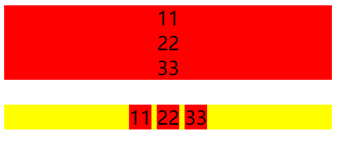
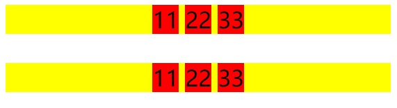
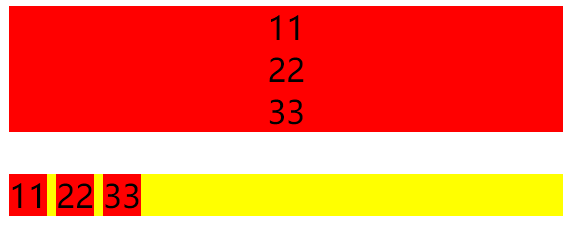
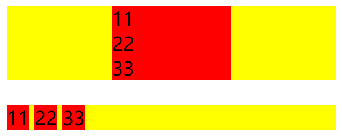
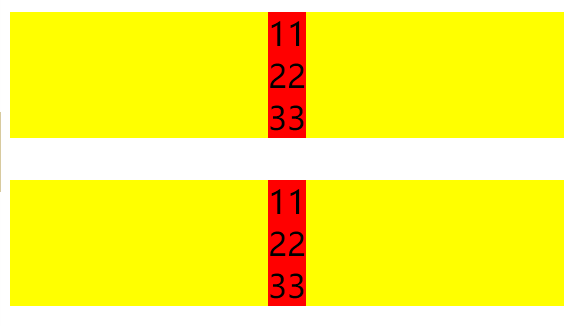
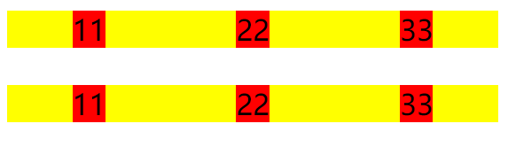
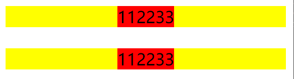
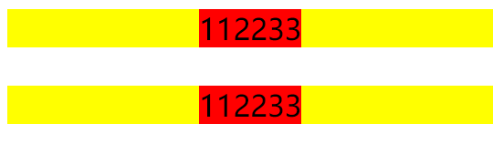
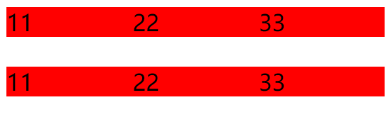

```html
<div class="parent" style="background-color: yellow;">
    <div class="children" style="background-color: red;">11</div>
    <div class="children" style="background-color: red;">22</div>
    <div class="children" style="background-color: red;">33</div>
</div>
<br>
<div class="parent" style="background-color: yellow;">
    <span class="children" style="background-color: red;">11</span>
    <span class="children" style="background-color: red;">22</span>
    <span class="children" style="background-color: red;">33</span>
</div>
```

## 0. 关于`text-align: center`

（1）不管`children`是块元素、行内元素、行内块元素，父元素添加`text-align: center`都可以水平居中

```css
.parent{
    text-align: center;
}
```



```css
.parent{
    text-align: center;
}
.children{
    display: inline-block/inline/inline-table/inline-flex;
}
```



（2）对于块元素来说，`children`加`text-align: center`也可以水平居中

```css
.children{
    text-align: center;
}
```



# 多个子元素

## 1. 块级元素

（1）

```css
.children{
    width: 100px;
    margin: 0 auto;
}
```



## 3. 块级和行内

（1）

```css
.children{
    display: table;
    margin: 0 auto;
}
```



（4）浮动

```css
.parent {
    float:left;
    position:relative;
    left:50%;
}
.children {
    float:left;
    position:relative;
    right:50%;
}
```


（5）flex

前面两个是git的，后面两个是子弈补充的

```css
.parent{
    display: flex;
}
.children{
    margin: 0 auto;
}
```



```css
.parent{
    display: flex;
    justify-content: center;
}
```



```css
.parent {
    display:flex;
    justify-content:center;
}
.children {
    float: left;
}
```



```css
.parent {
    display:flex;
    justify-content:center;
}
.children {
    float: left;
    width: 200px;
}
```



# 单个子元素

## 3. 块级和行内

（1）绝对定位

```css
.parent{
    position: relative;
}
.children{
    position: absolute;
    left: 50%;
    transform: translateX(-50%);
}
```


```css
.parent{
    position: relative;
}
.children{
    position: absolute;
    width: 100px;
    left: 50%;
    margin-left: -50px;
}
```


```css
.parent {
    position: relative;
}
.children {
    position: absolute;
    width: 100px;
    margin: 0 auto;
    left: 0;
    right: 0;
}
```


（3）浮动

```css
.parent {
    position: relative;
    left: 50%;
    margin-left: -50px;
    width: 300px;
}    
.children {
    float: left;
    width: 100px;
}
```


