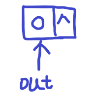

1、平方

```javascript
# 10的i次方
Math.pow(10,i)
```

2、链表都是没有头节点的

3、初始链表

```javascript
/**
 * Definition for singly-linked list.
 * function ListNode(val, next) {
 *     this.val = (val===undefined ? 0 : val)
 *     this.next = (next===undefined ? null : next)
 * }
 */
let out=new ListNode();
```



4、在js中初始链表新增长度不和c++一样是`p=p.next`，因为`p.next`是`null`，所以需要新增一个节点然后再`next`

```javascript
let p=new ListNode();
p.next=new ListNode();
p=p.next;
```
