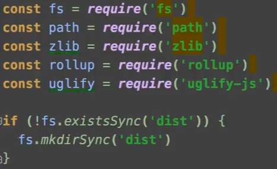
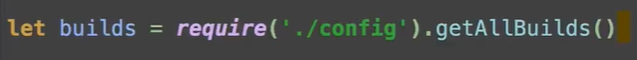
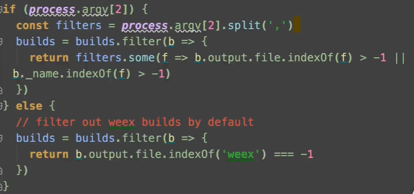

## vue 用 Rollup 做构建

[Rollup](https://github.com/rollup/rollup)和 webpack 一样都是构造工具，webpack 更强大，rollup 更适合 JavaScript 库的编译且更轻量，所以 js 选了 rollup 做构建

## 构建代码

vue 发布在 npm 上，每个 npm 包（相当于一个项目）都需要一个 package.json 文件来对他做描述。
|字段|含义|
|--|--|
| name | 名字 |
| version  | 版本 |
|main|入口|
|module|module和main非常类似，在webpack2以上是把module做默认入口|
|scripts|scripts定义了很多脚本，每个脚本都是一个任务，通过npm run 值（dev，bulid）可以进行各种不同的脚本，"build"就相当于跑scripts文件夹夏的build.js文件|

**build.js文件解析**
定义依赖的模块

拿到构建所需要的所有的配置

对配置进行过滤

调用build函数做真正的构建过程