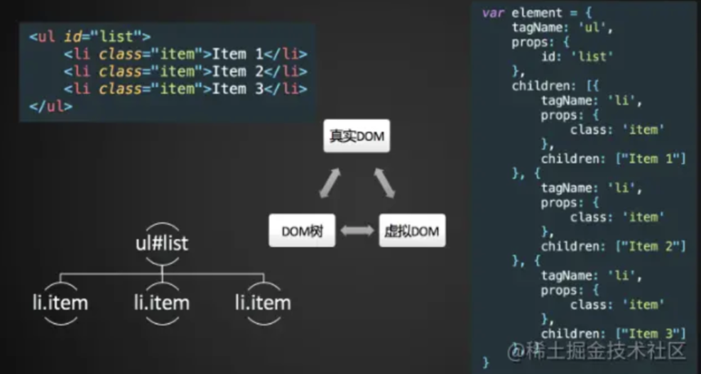

# Virtual DOM

关键词：

## Virtual DOM 产生的原因

Virtual DOM 产生的原因是因为浏览器中的 DOM 是很庞大复杂的，浏览器的标准就是把 DOM 设计的非常复杂，因此频繁操作 DOM 会有性能问题。

## Virtual DOM

Virtual DOM 就是用一个原生的 JS 对象去描述一个 DOM 节点，所以它比创建一个 DOM 的代价要小很多。 Virtual DOM 是用 VNode 去描述。



### Vue.js 中 Virtual DOM 的 VNode 的定义

#### src/core/vdom/vnode.js文件解析

vdom是虚拟DOM(Virtual DOM)的简称，指的是用JS模拟的DOM结构，将DOM变化的对比放在JS层来做。换而言之，vdom就是JS对象。

**整个 VNode 的定义就是一个 class**， class 有很多属性，例如`tag`标签，`VNodeData`数据是在**flow/vnode.js**定义的。 VNode 实际上是一个 Tree ，每一个 VNode 都有它的 children ，每一个 children 还是一个数组， children 还有它的 VNode ，整个就构造一个 VNode Tree 。 text 就是文本， elm 是对 DOM 对象的持有。

虚拟 DOM 到底是什么，说简单点，就是一个普通的 JavaScript 对象，包含了 tag、props、children 三个属性。

```html
<div id="app">
  <p class="text">hello world!!!</p>
</div>
```

上面的 HTML 转换为虚拟 DOM 如下：

```javascript
{
  tag: 'div',
  props: {
    id: 'app'
  },
  chidren: [
    {
      tag: 'p',
      props: {
        className: 'text'
      },
      chidren: [
        'hello world!!!'
      ]
    }
  ]
}
```

``` javascript
export default class VNode {
  tag: string | void;
  data: VNodeData | void;
  children: ?Array<VNode>;
  text: string | void;
  elm: Node | void;
  ns: string | void;
  context: Component | void; // rendered in this component's scope
  key: string | number | void;
  componentOptions: VNodeComponentOptions | void;
  componentInstance: Component | void; // component instance
  parent: VNode | void; // component placeholder node

  // strictly internal
  raw: boolean; // contains raw HTML? (server only)
  isStatic: boolean; // hoisted static node
  isRootInsert: boolean; // necessary for enter transition check
  isComment: boolean; // empty comment placeholder?
  isCloned: boolean; // is a cloned node?
  isOnce: boolean; // is a v-once node?
  asyncFactory: Function | void; // async component factory function
  asyncMeta: Object | void;
  isAsyncPlaceholder: boolean;
  ssrContext: Object | void;
  fnContext: Component | void; // real context vm for functional nodes
  fnOptions: ?ComponentOptions; // for SSR caching
  devtoolsMeta: ?Object; // used to store functional render context for devtools
  fnScopeId: ?string; // functional scope id support

  constructor (
    tag?: string,
    data?: VNodeData,
    children?: ?Array<VNode>,
    text?: string,
    elm?: Node,
    context?: Component,
    componentOptions?: VNodeComponentOptions,
    asyncFactory?: Function
  ) {
    this.tag = tag
    this.data = data
    this.children = children
    this.text = text
    this.elm = elm
    this.ns = undefined
    this.context = context
    this.fnContext = undefined
    this.fnOptions = undefined
    this.fnScopeId = undefined
    this.key = data && data.key
    this.componentOptions = componentOptions
    this.componentInstance = undefined
    this.parent = undefined
    this.raw = false
    this.isStatic = false
    this.isRootInsert = true
    this.isComment = false
    this.isCloned = false
    this.isOnce = false
    this.asyncFactory = asyncFactory
    this.asyncMeta = undefined
    this.isAsyncPlaceholder = false
  }

  // DEPRECATED: alias for componentInstance for backwards compat.
  /* istanbul ignore next */
  get child (): Component | void {
    return this.componentInstance
  }
}

```

当然有人说虚拟DOM并不比真实的DOM快，其实也是有道理的。当每一条数据都改变时，显然真实的DOM操作更快，因为虚拟DOM还存在js中diff算法的比对过程。所以，上述性能优势仅仅适用于大量数据的渲染并且改变的数据只是一小部分的情况。

实际上 Vue.js 中 Virtual DOM 是借鉴了一个开源库 snabbdom 的实现，然后加入了一些 Vue.js 特色的东西。

其实 VNode 是对真实 DOM 的一种抽象描述，它的核心定义无非就几个关键属性，标签名、数据、子节点、键值等，其它属性都是用来扩展 VNode 的灵活性以及实现一些特殊 feature 的。由于 VNode 只是用来映射到真实 DOM 的渲染，不需要包含操作 DOM 的方法，因此它是非常轻量和简单的。Virtual DOM 除了它的数据结构的定义，映射到真实的 DOM 实际上要经历 VNode 的 create、diff、patch 等过程。那么在 Vue.js 中，VNode 的 create 是通过之前提到的 createElement 方法创建的。
