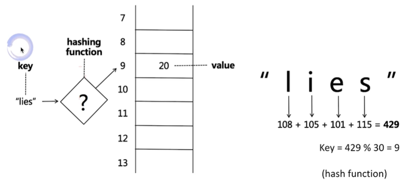
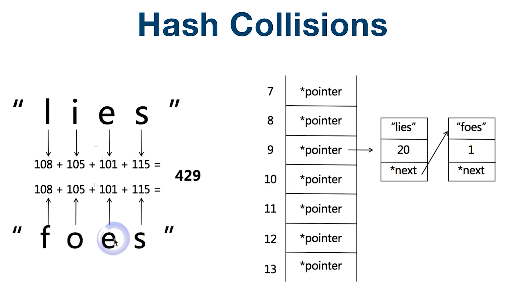
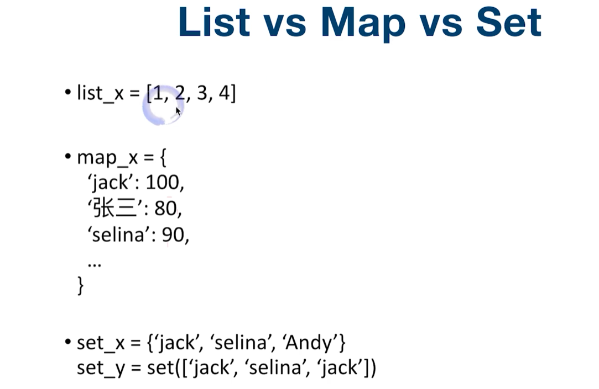
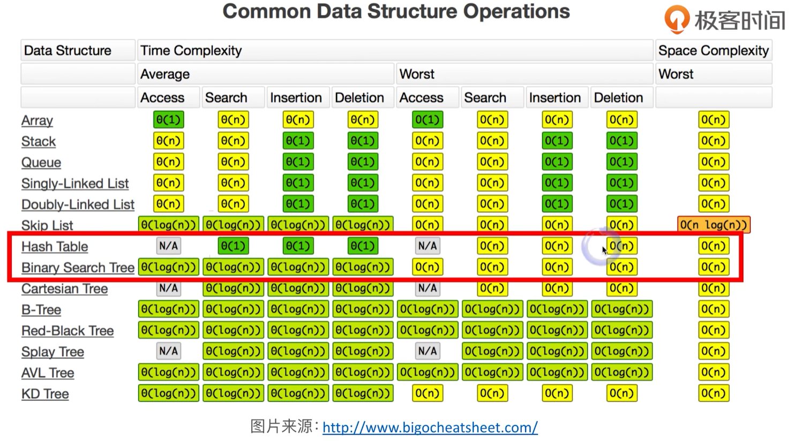

# 映射（Map）和集合（Set）

## 哈希表（HashTable）和哈希函数（Hash Function）和哈希碰撞（Collisions）

问：数据放数组，要查找某个数据，需要从头找到尾。如何用O(1)的形式来查找数据？

答：用哈希函数

### 1、哈希函数

假设hash的值是lies（人名），找到一个哈希函数，对映成一个数字，这个数字是0-29的下标（因为总共有30个值），然后放到相应的位置即可。这里选取的是每个字母的ASCII码，这里选择相加，也可以选择相乘，方法有很多。

### 2、哈希碰撞

使用哈希函数很容易发生碰撞，在碰撞的地方建立一个链表，所有元素都存在这个位置，相当于一个链表展开。————拉链法。

## 比较Map和Set

list可以想象成一个链，实现可以是数组也可以是链表。关键是可以重复的，同时所有元素都放在一个表里面。插入时间复杂度是O(1)，查找是O(n)。

map是映射，前面是key，后面是value，是key和value之间的对应关系。

集合和map很相似，可以当作map的key。集合不允许有重复的元素，也可以理解为是list去重之后就是集合。集合是用哈希表或者二叉树的形式来实现，所以查找的时间复杂度是O(1)或者O(log2n)。所以比list效率更高。

## HashMap、HashSet、TreeMap、TreeSet

HashMap和HashSet是拿哈希表存，TreeMap和TreeSet用二叉树存。所以前者在查询的时候是O(1)的时间复杂度，后者是O(log2n)的时间复杂度。用TreeMap和TreeSet的好处是所有的元素都排好序的，HashMap和HashSet是乱序的，所以对时间复杂度要求很高的时候用HashMap和HashSet，要求用相对有序的方式进行储存的话，需要使用TreeMap和TreeSet。

