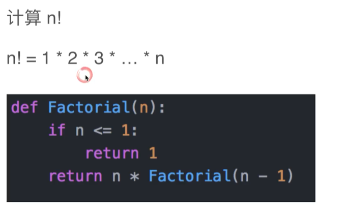
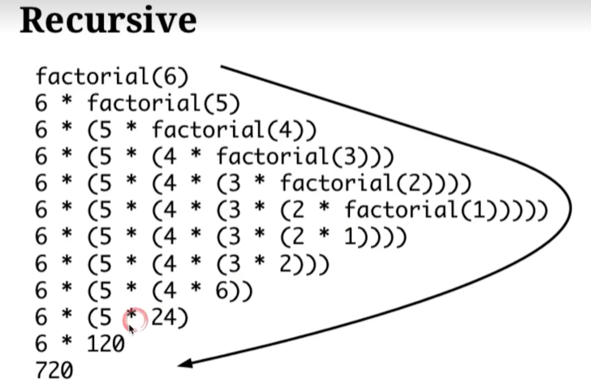
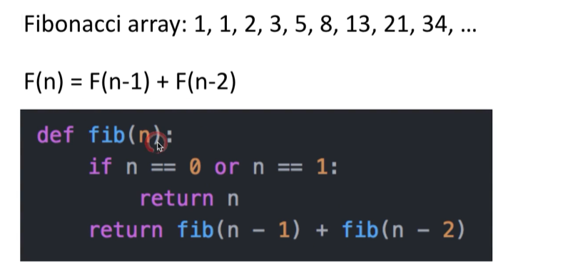
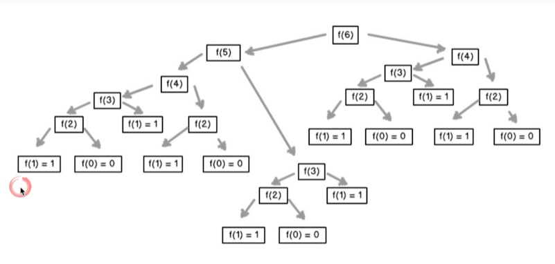

## 递归

递归是一种循环，只不过不是一个 for 循环，而是函数自己调自己来实现类似循环的状态。

递归的组成部分：
1、level：表示在第几层，或者有没有在递归中
2、递归的终止条件，一般写在最前面
3、要进行的业务逻辑
4、调用自身

## 分治

先把大问题剖成子问题，再把子问题一一解决

1、problem：相当于level，把问题分成几个
2、递归终止条件
3、准备数据，把当前大问题拆分成小问题
4、