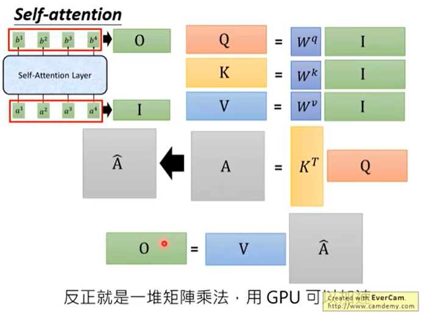

BERT是unsupervise train的transformer，transformer是Seq2seq model（补），transformer特殊的地方就是在Seq2seq model中用到了大量的self-attention layer。

## self-attention layer 做的是什么

### 背景
#### RNN
要处理一个sequence，最常想到要拿来用的network架构就是RNN（补），RNN的输入就是一串sequence，输出又是另外一串sequence，RNN的问题是不容易被并行化。
#### CNN

每一个三角形代表一个filter，filter的输入就是sequence其中的一小段，跟filter里面的参数做inner product，输出一个数值。filter扫过sequence，产生一排数值。filter不止一个，每一个会产生一排不同的数值。
CNN可以做到和RNN同样的输入和输出。缺点是CNN只能考虑非常有限的内容，它也可以考虑比较长的咨询，就是叠加很多层CNN，上层的filter就可以考虑比较多的资讯。CNN的好处是可以并行化，不需要等第一个三角形算完再算第二个，也不需要等红色的filter算完再算黄色的filter。

### self-attention

self-attention layer要做的事情就是取代RNN，他也是输入sequence输出一个sequence，特别的地方是每个输出都看过整个input sequence，并且每个输出都是同时计算的。

#### 概念公式

input是x1-->x4这个sequence，每个input通过embedding变成a1-->a4再丢到self-attention layer。每个都乘上三个不同的transformation产生三个不同的filter，分别是q，k，v。q代表query，去match其他。k代表key，是被match的。v代表要被抽取出来的information。

要做的事情就是拿每个q对每个k做attention。例如q1和k1做attention（attention有各式各样的做法，本质上就是吃两个向量输出两个向量有多匹配）输出一个分数α1,1。然后拿q1和k2做attention得到α1,2，以此类推得到α1,3和α1,4。attention用的是scaled dot-product attention，d是q跟k的dimension（维度）。

接下来将α1,1-->α1,4通过softmax layer得到进一步的α1,1-->α1,4。softmax就是将每一个α做exp然后除去所有α做exp的总和。

拿新的α和对应的v去相乘再相加得到b1（可以在同一时间算出b2，b3等）。如果不想考虑整个sequence，只考虑a1，可以将产生出来的数变成0即可。这就是self-attention的妙用。

#### 拿矩阵运算表示运算过程

将a1-->a4拼起来组成一个I，则Q=Wq*I，同理K=Wk*I，V=Wv*I。

### multi-head self-attention

有一个变形的self-attention叫multi-head self-attention。用2个head来举例。

每个ai都会得到qi、ki和vi，在有两个head的情况下，会进一步把qi分裂成qi,1和qi,2。k和v也是如此。需要注意的是qi,1只会和ki,1、kj,1等第一个进行attention。最后计算出bi,1。

qi,2也是一样。如果把bi,1和bi,2连起来，做transform，可以得到bi。

## transformer

encoder的输入是中文的机器学习，decoder的输入先给一个`<BOS>`（这是一个token），然后输出一个machine，再把machine当输入，输出learning，直至输出句号。

### Encoder

input通过input embedding变成一个vector，vector加上positional encoding进入灰色的block，灰色的block会重复N次，灰色的block里面第一层是Multi-Head Attention（输入一个sequence会得到另外一个sequence），下一个layer是Add&Norm（Add的意思是会把Multi-Head Attention的input和output加起来，例如会把input a和input b加起来得到b'，Norm是指把b'再做Layer Norm），Feed Forward会把每一个vector都进行处理，同时还有另外一个Add&Norm。

### Decoder

decoder的input是它前一个timestep所产生的output，通过output embedding加上positional embedding进入灰色的block，灰色的block依旧会重复N次，第一层是Masked Multi-Head Attention（mask的意思是在做self-attention的时候这个decoder是会attend到已经产生出来的sequence），也一样又一个Add&Norm，接下来Multi-Head Attention是attend到之前encoder部分的输出，然后再做Add&Norm、Feed Forward和Add&Norm，再做Linear再做softmax得到最终的output

