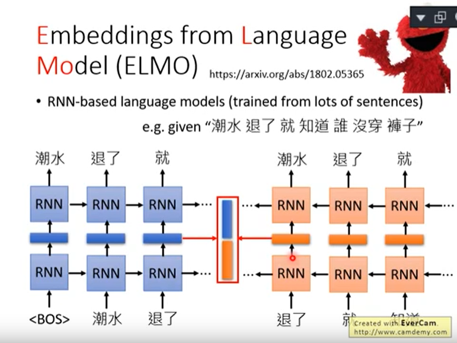

## 没有BERT之前：1-of-N Encoding-->Word Class-->Word Embedding

### 1、1-of-N Encoding

每一个词汇都当做一个不同的符号，每一个符号都用一个独特的编码表示，最常见的做法是1-of-N Encoding。即每个词汇都用一个不同的向量去描述。

缺点：词汇和词汇之间没有任何关联，把每个词汇都当成一个独立的关系。

### 2、Word Class

对词汇进行分类

缺点：分类过于粗糙

### 3、Word Embedding

每个词汇都用向量来表示，向量的某个维度表示词汇的某个意思，语义相近的词汇向量比较接近。

## ELMO

#### 背景

在过去的Word Embedding，所有不同的token，只要type是一样的，他们的语义就是一样的。但是事实并不是如此，不同的token就算是同样的type，也有可能有不同的意思。例如这里的bank应该有两种type，即两种不同的意思。

#### ELMO模型

搜集一大堆句子，训练RNN-base language models，学预测下一个token是什么，学完以后就有contextualized word embedding

正向考虑词汇前文，反向考虑词汇后文，将前后文的contextualized word embedding组合起来就可以得到一个比较准确的contextualized word embedding

ELMO是一个词汇丢进去可以吐出不止一个embedding，每一层RNN都会给一个embedding，把这些embedding都加起来，公式是h1*α1+h2*α2=新的embedding，α1和α2是learn出来的，首先要决定做什么task，不同的任务α1和α2是不一样的。

## BERT

BERT是Bidirectional Encoder Representation from Transformers的缩写，BERT是transformer的encoder。BERT里面只需要搜集一大堆的句子，不需要有annotation就可以把encoder给tran出来。总而言之，BERT的功能就是一个句子丢进去给BERT，然后每一个句子都会吐一个出来embedding出来就结束了。BERT的Network架构是跟transformer的encoder架构是一样的，transformer的encoder里面有self-attention layer。self-attention layer就是input一个sequence也会out一个sequence。

### 训练BERT

BERT的network有两个训练的方法，第一个方法是Nasked LM，第二个方法是Next Sentence Prediction。

#### Nasked LM

将输入的句子中的15%的词汇随机被置换成一个特殊的token，token叫做MASK。BERT要做的是猜测被盖住的地方到底应该是哪个词汇，BERT在训练的时候就是教她测漏字问题。

问：BERT是怎么填回来的呢？
答：假设输入句子的第二个词汇被挖空，接下来我们把每一个input token都通过BERT都会得到一个embedding。接下来把挖空的地方的embedding丢到Linear Multi-class Classifier里面，要求Classifier预测被MASK的词汇是哪一个词汇。因为Classifier是Linear的，所以能力非常弱，如果可以预测出来，那BERT这个model会很深，可能24层48层。BERT这个model一定要抽出一个很好的Representation，可以从这个Representation轻易知道现在被MASK的词汇是哪一个词汇。

如果两个词填在一个地方没有违和感，那他们就有相似的embedding

### Next Sentence Prediction

给BERT两个句子，BERT预测给的两个句子是接在一起的还是不是接在一起的。需要引入一个特别的token代表两个句子之间的boundary：[SEP]和放在句子开头代表从这里开始做Next Sentence Prediction这件事：[CLS]。从CLS出来的embedding放到Linear Multi-class Classifier里表示这两个句子是否接在一起，是的话是yes，不是的话是no。

问：为什么CLS放在句子开头？
答：BERT内部不是RNN，是transformer encoder，也就是self-attention，self-attention的特色是两个距离不管远近的word对他来说是一样的。

#### 总结

这两个方法在文献上是共同使用的