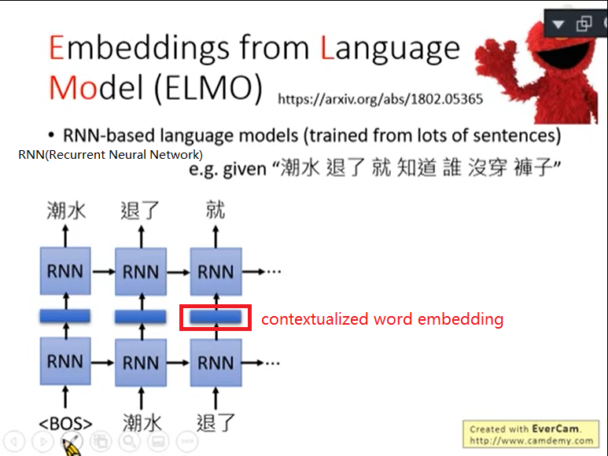

## 没有BERT之前：1-of-N Encoding-->Word Class-->Word Embedding

### 1、1-of-N Encoding

每一个词汇都当做一个不同的符号，每一个符号都用一个独特的编码表示，最常见的做法是1-of-N Encoding。即每个词汇都用一个不同的向量去描述。

缺点：词汇和词汇之间没有任何关联，把每个词汇都当成一个独立的关系。

### 2、Word Class

对词汇进行分类

缺点：分类过于粗糙

### 3、Word Embedding

每个词汇都用向量来表示，向量的某个维度表示词汇的某个意思，语义相近的词汇向量比较接近。

## ELMO

#### 背景

在过去的Word Embedding，所有不同的token，只要type是一样的，他们的语义就是一样的。但是事实并不是如此，不同的token就算是同样的type，也有可能有不同的意思。例如这里的bank应该有两种type，即两种不同的意思。

#### ELMO模型

搜集一大堆句子，训练RNN-base language models，学预测下一个token是什么，学完以后就有contextualized word embedding

正向考虑词汇前文，反向考虑词汇后文，将前后文的contextualized word embedding组合起来就可以得到一个比较准确的contextualized word embedding

ELMO是一个词汇丢进去可以吐出不止一个embedding，每一层RNN都会给一个embedding，把这些embedding都加起来，公式是h1*α1+h2*α2=新的embedding，α1和α2是learn出来的，首先要决定做什么task，不同的任务α1和α2是不一样的。

## BERT

BERT是Bidirectional Encoder Representation from Transformers的缩写，BERT是transformer的encoder。BERT里面只需要搜集一大堆的句子，不需要有annotation就可以把encoder给tran出来。总而言之，BERT的功能就是一个句子丢进去给BERT，然后每一个句子都会吐一个出来embedding出来就结束了。BERT的Network架构是跟transformer的encoder架构是一样的，transformer的encoder里面有self-attention layer。self-attention layer就是input一个sequence也会out一个sequence。

### 训练BERT

BERT的network有两个训练的方法，第一个方法是Nasked LM，第二个方法是Next Sentence Prediction。

#### Nasked LM

将输入的句子中的15%的词汇随机被置换成一个特殊的token，token叫做MASK。BERT要做的是猜测被盖住的地方到底应该是哪个词汇，BERT在训练的时候就是教她测漏字问题。

问：BERT是怎么填回来的呢？
答：假设输入句子的第二个词汇被挖空，接下来我们把每一个input token都通过BERT都会得到一个embedding。接下来把挖空的地方的embedding丢到Linear Multi-class Classifier里面，要求Classifier预测被MASK的词汇是哪一个词汇。因为Classifier是Linear的，所以能力非常弱，如果可以预测出来，那BERT这个model会很深，可能24层48层。BERT这个model一定要抽出一个很好的Representation，可以从这个Representation轻易知道现在被MASK的词汇是哪一个词汇。

如果两个词填在一个地方没有违和感，那他们就有相似的embedding

#### Next Sentence Prediction

给BERT两个句子，BERT预测给的两个句子是接在一起的还是不是接在一起的。需要引入一个特别的token代表两个句子之间的boundary：[SEP]和放在句子开头代表从这里开始做Next Sentence Prediction这件事：[CLS]。从CLS出来的embedding放到Linear Multi-class Classifier里表示这两个句子是否接在一起，是的话是yes，不是的话是no。

问：为什么CLS放在句子开头？
答：BERT内部不是RNN，是transformer encoder，也就是self-attention，self-attention的特色是两个距离不管远近的word对他来说是一样的。

#### 总结

这两个方法在文献上是共同使用的，会学得最好。

### 如何使用BERT

案例1：输入sentence输出class（判断句子正负面，文章分类）

在开头添加CLS（代表分类的符合）得到embedding放到Linear Classifier得到class判断是正面还是负面。Linear Classifier的参数是随机初始化的，所以Linear Classifier是trained from scratch（从头开始训练）。BERT只要微调就好。

案例2：输入sentence输出每一个词汇都要决定它属于哪个class

例子：slot filling

input一个句子每个词都会output一个embedding，把每一个embedding都丢到Linear Classifier，决定embedding属于哪个class

案例3：输入两个句子输出一个class（natural language inference）

给机器一个前提和假设，根据前提和假设判断是对还是错还是不知道。给BERT两个句子，第一个句子前面加[CLS]后面加[SEP]，将开头输出的embedding丢给Linear Classifier决定是对还是错还是不知道。

案例4：拿BERT解Extraction Question Answering，给model读一篇文章，然后问他一个问题，希望他可以正确的得到答案。但是这个答案一定会出现在文章里面。

给文章和问题，都是用token的sequence表示，假设文章D有n个token，文章Q有m个token，然后output两个整数s和e，表示现在文章的答案落在第s个token到第e个token

问题输进去然后给[SEP]然后再把文章输进去，文章里面每个词汇都有一个embedding。拿到两个红蓝向量，红向量与文字的每一个embedding做类似attention的动作，都会算出一个scaler，把scaler通过softmax得到一个分数，第几个得到最高的分数则s=第几，所以红色向量决定s=几。

蓝向量与文章每一个embedding做类似attention的动作算出分数再通过softmax看哪个分数最高就得出e

问：s和e矛盾了（即s比e大）怎么办?
答：没有答案了，回答此题无解。

### ERNIE

## GPT