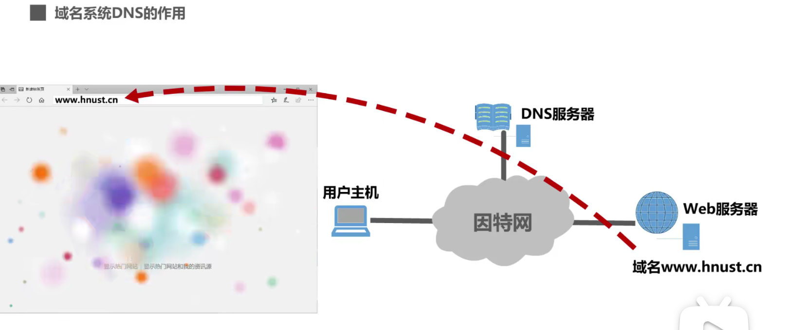
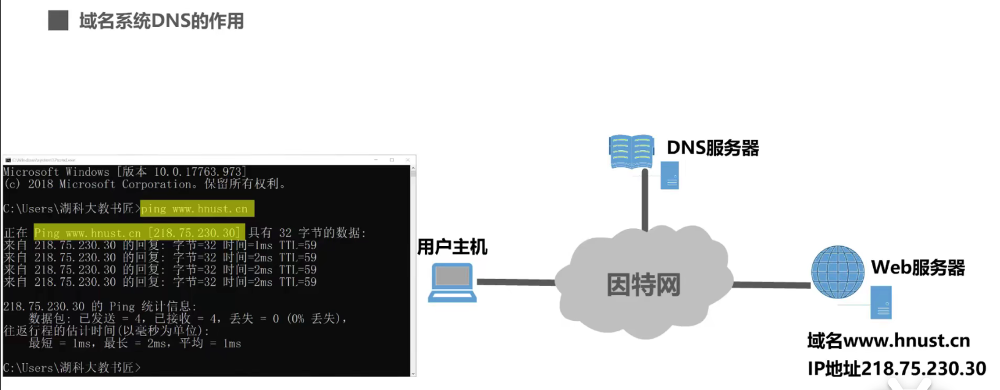
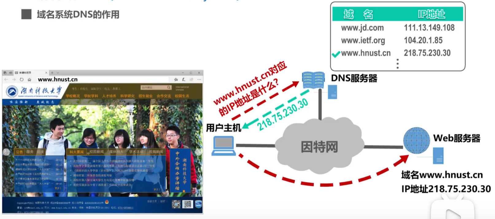
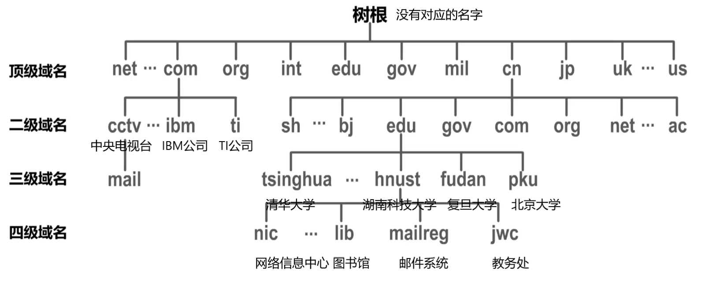
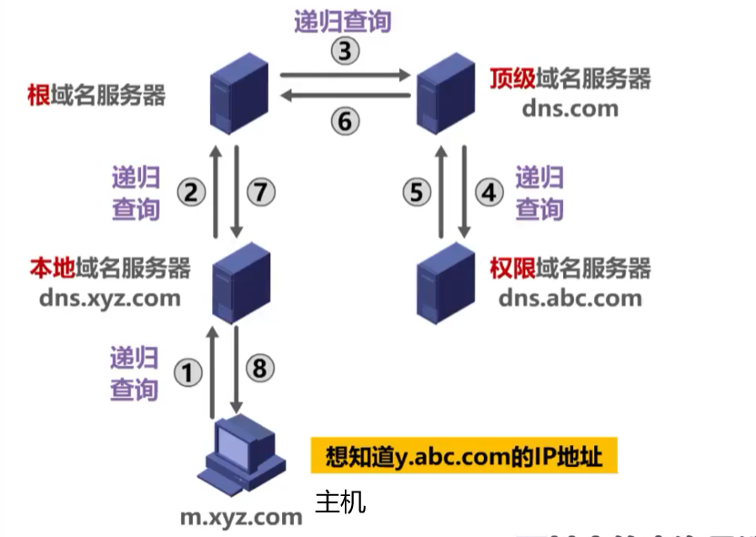
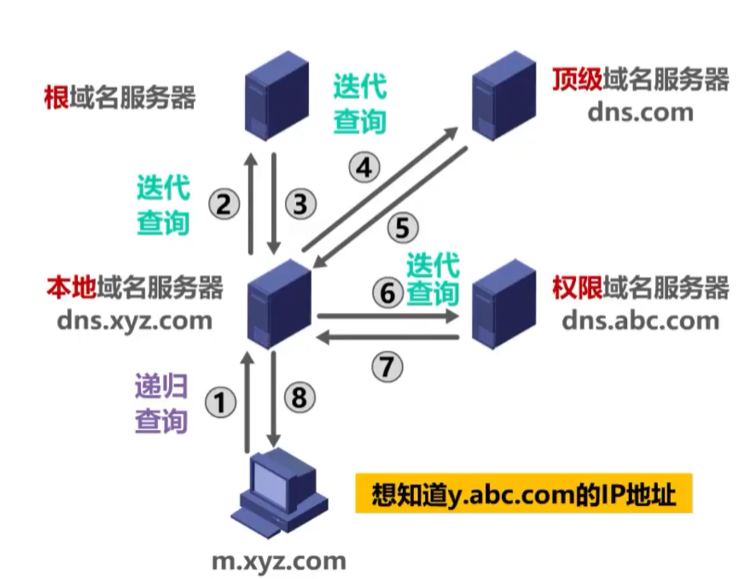
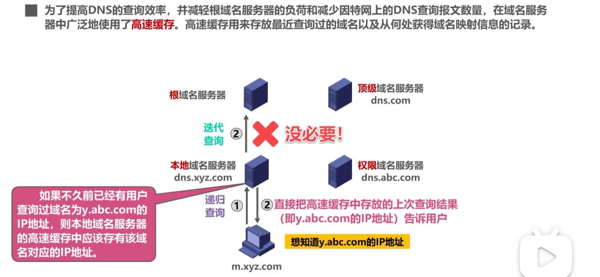

# 域名系统DNS

## 1. 域名系统DNS的作用

（1）因特网中的某台主机要访问**某台 Web 服务器**，我们只需在用户主机中运行某个浏览器软件，在其地址栏中输入要访问的 Web 服务器的**域名**，并按下回车键，即可访问到 Web 服务器所提供的内容。

在用户主机中使用 ping 命令，来测试一下用户主机与 Web 服务器的连通性。 ping 的是 Web 服务器的**域名**，但是 ping 命令实际上 ping 的是 Web 服务器的 IP 地址。这跟**TCP/ IP 体系采用 IP 地址进行寻址**的知识是一致的。也就是说**即使不使用域名也可以通过 IP 地址来寻址目的主机**。但域名和 IP 地址相比，便于人们记忆。因此对于大部分网络应用一般使用域名来访问目的主机，而不是直接使用 IP 地址访问。

（2）当在浏览器地址栏中输入某个 Web 服务器的域名时，用户主机会首先在自己的 DNS 高速缓存中查找该域名所对应的 IP 地址。如果没有找到，则会向网络中的某台 DNS 服务器查询。 DNS 服务器中有域名和 IP 地址映射关系的数据库。当 DNS 服务器收到 DNS 查询报文后，在其数据库中进行查询，之后将查询结果发送给用户主机。用户主机中的浏览器就可以通过 Web 服务器的 IP 地址对其进行访问了。

问：因特网是否可以只是用一台 DNS 服务器？

答：理论上可行，实践中不可取。这种做法并不可取。因为因特网的规模很大，这样的域名服务器肯定会因为超负荷而无法正常工作，而且ー域名服务器出现故障，整个因特网就会瘫痪。早在1983年，因特网就开始采用**层次结构的命名树**作为主机的名字（即域名）并使用**分布式的域名系统** DNS 。 DNS 使**大多数域名都在本地解析**，仅少量解析需要在因特网上通信，因此系统效率很高。由于 DNS 是分布式系统，即使单个计算机出了故障，也不会妨碍整个系统的正常运行。

## 2.层次树状结构的域名结构

因特网采用层次树状结构的域名结构。域名的结构由若干个分量组成，各分量之间用“点”隔开，分别代表不同级别的域名。

每一级的域名都由英文字母和数字组成，不超过63个字符，不区分大小写字母。级别最低的域名写在最左边，而级别最高的顶级域名写在最右边。完整的域名不超过255个字符。域名系统既不规定一个域名需要包含多少个下级域名，也不规定每一级的域名代表什么意思。各级域名由其上一级的域名管理机构管理，而最高的顶级域名则由因特网名称与数字地址分配机构 CANN 进行管理。

cn ：顶级域名，表示中国
edu ：在其下注册的二级域名，表示教育机构
hnust ：在 edu 下注册的三级域名，表示湖南科技大学
nic ：湖南科技大学自行管理的四级域名，表示网络信息中心

### 2.1顶级域名

顶级域名 TLD (Top Level Domain)分为以下三类：
1. 国家顶级域名 nTLD ：采用SO3166的规定。如 cn 表示中国， us 表示美国， uk 表示英国、等等。
2. 通用顶级域名 gTLD ：最常见的通用顶级域名有七个，即： com （公司企业）、 net (网络服务机构）、 org （非营利性组织）、 int （国际组织）、 edu （美国教育结构）、 gov （美国政府部门）、 mil （美国军事部门）。
3. 反向域 arpa ：用于反向域名解析，即 IP 地址反向解析为域名。

### 2.2二级域名

在国家顶级域名下注册的二级域名均由该国家自行确定。例如，顶级域名为jp的日本，将其教育和企业机构的二级域名定为ac和co，而不用edu和com.

我国则将二级域名划分为以下两类：
1. 类别域名共七个： ac （科研机构）、 com (工、商、金融等企业)、 edu （教育机构）、 gov （政府部门）、 net （提供网络服务的机构）、 mil （军事机构）和 org (非营利性组织）。
2. 行政区域名共34个，适用于我国的各省、自治区、直辖市。例如： bj 为北京市、 sh 为上海市、 js 为江苏省，等等。

注意：名称相同的域名等级未必相同。

### 3.因特网的域名空间

这种按等级管理的命名方法便于维护名字的唯一性，并且也容易设计出一种高效的域名查询机制。需要注意的是，**域名只是个逻辑概念，并不代表计算机所在的物理地点。**

## 4.域名服务器

域名和 IP 地址的映射关系必须保存在域名服务器中，供所有其他应用查询。显然不能将所有信息都储存在一台域名服务器中。 DNS 使用分布在各地的域名服务器来实现域名到 IP 地址的转换。

域名服务器可以划分为以下四种不同的类型：
1. **根域名服务器**：根域名服务器是最高层次的域名服务器。每个**根**域名服务器都知道所有的**顶级**域名服务器的域名及其 IP 地址。因特网上共有13个不同 IP 地址的根域名服务器。尽管我们将这13个根域名服务器中的每一个都视为单个的服务器，但“每台服务器”实际上是由许多分布在世界各地的计算机构成的服务器群集。当**本地**域名服务器向**根**域名服务器发出查询请求时，路由器就把查询请求报文转发到离这个 DNS 客户最近的一个根域名服务器。这就加快了 DNS 的查询过程，同时也更合理地利用了因特网的资源。**根域名服务器通常井不直接对域名进行解析，而是返回该域名所属顶级域名的顶级域名服务器的 IP 地址。**
2. **顶级域名服务器**：这些域名服务器负责**管理在该顶级域名服务器注册的所有二级域名**。当收到 DNS 查询请求时就给出相应的回答（可能是最后的结果，也可能是下一级**权限**域名服务器的 IP 地址）。
3. **权限域名服务器**：这些域名服务器负责**管理某个区的域名**。每一个主机的域名都必须在某个权限域名服务器处注册登记。因此权限域名服务器**知道其管辖的域名与 IP 地址的映射关系**。另外，权限域名服务器还知道其下级域名服务器的地址。
4. **本地域名服务器**（我只是一个转发者）：本地域名服务器不属于上述的域名服务器的等级结构。当一个主机发出 DNS 请求报文时，这个报文就首先被送往该主机的本地域名服务器。本地域名服务器**起着代理的作用，会将该报文转发到上述的域名服务器的等级结构中**。每一个因特网服务提供者ISP，例如一个入学，甚至一个大学里的学院，都可以拥有一个本地域名服务器，它有时也称为默认域名服务器。本地域名服务器离用户较近，一般不超过几令路由器的距离，也有可能就在同一个局域网中，本地域名服务器的 IP 地址需要直接配置在需要域名解析的主机中。

## 5.域名解析的过程

包含两种查询方式：递归查询和迭代查询。先知道顶级域名，再知道二级域名，再知道三级域名。所以要先对根域名服务器发送查询，再向顶级域名服务器查询，再多次向权限域名服务器查询。

### 5.1 递归查询

主机想知道域名 y.abc.com 的 IP 地址，主机首先向其本地域名服务器进行递归查询，本地域名服务器收到递归查询的委托后，采用递归查询的方式向某个根域名服务器查询。根域名服务器收到递归查询的委托后，采用递归查询的方式向某个顶级域名服务器查询。顶级域名服务器收到递归查询的委托后，采用递归查询的方式向某个权限域名服务器查询。当查询到域名所对应的 IP 地址后，查询结果会在之前受委托的各域名服务器之间传递，最终传回给用户主机。

### 5.2 迭代查询

由于递归查询对于被查询的域名服务器负担太大，通常采用以下模式：从请求主机到本地域名服务器的查询是递归查询，而其余的查询是迭代查询。

### 5.3 高速缓存

为了提高 DNS 的查询效率，并减轻根域名服务器的负荷和减少因特网上的 DNS 查询报文数量，在域名服务器中广泛地使用了**高速缓存**。高速缓存用来存放最近查询过的域名以及从何处获得域名映射信息的记录。

由于域名到 IP 地址的映射关系并不是永久不变，为保持高速缓存中的内容正确，域名服务器应为每项内容设置计时器井删除超过合理时间的项(例如，每个项目只存放两天)。

不但在本地域名服务器中需要高速缓存，在用户主机中也很需要。许多用户主机在启动时从本地域名服务器下载域名和 IP 地址的全部数据库，维护存放自己最近使用的域名的高速缓存，并且只在从缓存中找不到域名时才向域名服务器查询。同理，主机也需要保持高速缓存中内容的正确性。

 DNS 报文使用运输层的UDP协议进行封装，运输层端口号为53。