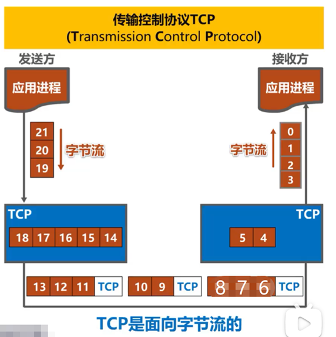

# UDP 和 TCP

 UDP ：用户数据报协议（User Datagram Protocol）
 TCP ：传输控制协议（Transmission Control Protocol）

 UDP 和 TCP 是**TCP /IP体系结构**运输层中的两个重要协议。在使用 TCP /IP体系结构的网络通信中，这两个协议的使用频率仅次于网际层的 IP 协议。 TCP /IP体系结构应用层的某些协议，需要使用运输层 TCP 提供的服务，而另一些协议需要使用运输层的 UDP 提供的服务。

## UDP 和 TCP的对比

1、关于面向连接

这是因特网的两台主机，他们在运输层使用 UDP 协议进行通信。纵坐标为时间，使用 UDP 协议的通信双方，可以随时发送数据。
使用 TCP 协议的通信双方，在进行数据传输之前，必须使用“三报文握手”来建立 TCP 连接， TCP 连接建立成功后才能进行数据传输。数据传输结束后，必须使用“四报文挥手”来释放 TCP 连接。
需要注意的是，这里所谓的连接是指逻辑连接关系，而不是物理连接。

总结： UDP 无连接， TCP 面向连接。

2、关于通信

这是某个局域网上需要使用 UDP 协议进行通信的四台主机，其中任何一台主机都可以向其他三台主机发送广播，也可以向某个多播组发送多播，还可以向某台主机发送单播。

总结： UDP 支持单播、多播以及广播。换句话说， UDP 支持一对一、一对多、一对全的通信。

使用 TCP 协议通信的双方在进行数据传输之前，必须使用“三报文握手”来建立 TCP 连接。 TCP 连接建立成功之后，通信双方之间好像有一条可靠的通信信道。通信双方使用这条基于 TCP 连接的可靠信道进行通信。

总结： TCP 仅支持单播，也就是一对一的通信。

3、关于应用报文

发送方的应用进程将应用层报文交付给运输层的 UDP ， UDP 直接给应用层报文添加一个 UDP 首部，使之成为 UDP 用户数据报，然后进行发送。接收方的 UDP 收到该 UDP 用户数据报后，去掉 UDP 首部，将应用层报文直接交付给应用进程。

总结： UDP 对应用进程交下来的报文既不合并也不拆分，而是保留这些报文的边界，换句话说， UDP 是**面向应用报文**（面向报文段）的。

发送方的 TCP 把应用进程交付下来的数据块仅仅看作是一连串的、无结构的字节流。 TCP 并不知道这些待传送的字节流的含义，仅将他们编号并存储在自己的发送缓存中， TCP 根据发送策略从发送缓存中提取一定数量的字节构建 TCP 报文段并发送。接收方的 TCP 一方面从所接收到的 TCP 报文段中取出数据载荷部分并存储在接收缓存中，一方面将接收缓存中的一些字节交付给应用进程。 TCP **不保证**接收方应用进程所收到的数据块与发送方进程所发出的数据块具有对应大小的关系。例如发送方应用进程交给发送方的 TCP 共10个数据块，但接受方的 TCP 可能只用了4个数据块就把收到的字节流交付给了上层的应用进程。但接收方应用进程收到的字节流**必须**和发送方应用进程发出的字节流完全一样。

问：收到的都散架了，为什么还可靠？
答：有序号可以拼起来/切块数量不一样，拼起来的内容是一样的/对应主机上面的 TCP 协议分数据块大小不一样而已，同样的一段字节流，一个分的块小一点，一个分的块大一点而已

当然，接收方的应用进程**必须**有能力识别收到的字节流，把它还原成有意义的应用层数据。也就是说， TCP 是**面向字节流**的，这正是 TCP 实现可靠传输、流量控制、以及拥塞控制的基础。图中只画出了一个方向的数据流，在实际网络中，基于 TCP 连接的两端，可以**同时进行** TCP 报文段的发送和接收，也就是全双工通信。另外，图中 TCP 报文段的数据部分只包含了几个字节，实际当中一个 TCP 报文段包含上千个字节是很**常见**的。

4、关于误码、丢失

的网际层向其上层提供的是无连接不可靠的传输服务。因此对于 UDP 用户数据报出现的误码和丢失等问题， UDP 并不关心。基于 UDP 这个特点， UDP 适用于实时应用，例如IP电话、视频会议等。

尽管网际层中的IP协议向其上层提供的是无连接不可靠的传输服务，也就是说IP数据包可能在传输过程中出现丢失或误码。但只要运输层使用 TCP 协议，就可向其上层提供面向连接的可靠传输服务。我们可将其想象成使用 TCP 协议的收发双方基于 TCP 连接的可靠信道进行数据传输。不会出现误码、丢失、乱序以及重复等传输差错。 TCP 适用于要求可靠传输的应用，例如文件传输。

5、关于 UDP 用户数据报首部与 TCP 报文段的首部

一个 UDP 数据报由首部和数据载荷两个部分构成。首部只有四个字段，每个字段长度为两个字节。由于 UDP 不提供可靠传输服务，它仅仅在网际层的基础上添加了用于区分应用进程的端口，因此他的首部非常简单，仅有八个字节。

一个 TCP 报文段由首部和数据载荷两部分构成，首部比 UDP 用户数据报首部复杂很多，其最小长度为20字节，最大长度60字节。这是因为 TCP 要实现可靠传输、流量控制和拥塞控制等服务，其首部自然比较复杂。首部中的字段比较多，首部长度也比较长

总结：

