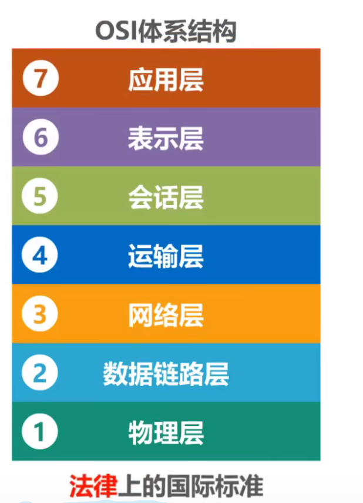
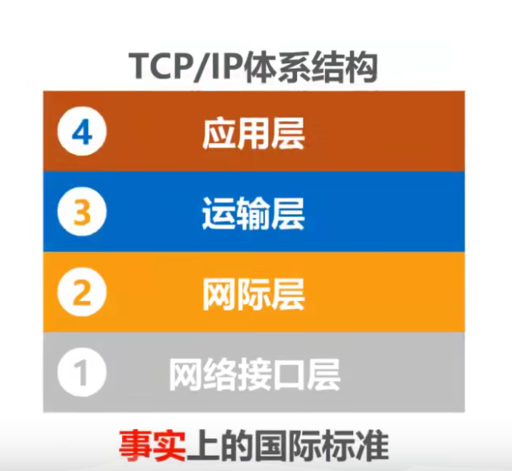

# 常见的计算机网络体系结构

1、 OSI 体系结构：法律上的国际标准

应用层、表示层、会话层、运输层、网络层、数据链路层、物理层

2、 TCP/IP 体系结构：事实上的国际标准

应用层、运输层、网际层、网络接口层

- 将 OSI 体系结构的物理层和数据链路层合并成为了 TCP/IP 体系结构的网络接口层
- 去掉了会话层和表示层
- 由于 TCP/IP 在网络层使用的协议是 IP 协议， IP 协议的中文意思是网际协议，所以 TCP/IP 体系结构的网络层称为网际层

## 

用户的主机必须使用 TCP/IP 协议（不论使不使用因特网），在用户主机的操作系统中，通常都带有符合 **TCP/IP 体系结构**标准的 TCP/IP 协议族。而用户网络互联的路由器中，也带有符合 **TCP/IP 体系结构**标准的 TCP/IP 协议族，只不过路由器一般只包含网络接口层和网际层。 **TCP/IP 体系结构**的网络接口层并没有规定什么具体的内容，这样做的目的是可以互连全世界各种不同的网络接口，例如有线的以太网接口、无线局域网的 WiFi 接口，而不限定仅使用一种或几种网络接口。因此本质上 **TCP/IP 体系结构**只有上面的三层。
IP协议是 **TCP/IP 体系结构**网际层的核心协议，TCP和UDP是 **TCP/IP 体系结构**运输层的两个重要协议， **TCP/IP 体系结构**的应用层包含了大量的应用层协议，例如 HTTP 、 SMTP 、 DNS 、 RTP 等。HTTP 在浏览器地址栏输入网址时就会看到。

IP 协议可以将不同的网络接口进行互连，并向其上的 TCP 协议和 UDP 协议提供网络互连服务。而 TCP 协议在享受 IP 协议提供的网络互联服务的基础上，可向应用层的相应协议提供可靠传输的服务； UDP 协议在享受 IP 协议提供的网络互联服务的基础上，可向应用层的相应协议提供不可靠传输的服务。 IP 协议作为 TCP/IP 体系结构中的核心协议，一方面负责互连不同的网络接口，也就是 IP over everything ；另一方面，为各种网络应用提供服务，也就是 everything over IP 。在 TCP/IP 协议体系中含有大量的协议，IP协议和TCP协议是其中非常重要的两个协议，因此用 TCP 和 IP 这两个协议来表示整个协议大家族，常称为 TCP/IP 协议族。在嵌入系统开发领域， TCP/IP 协议族常称为 TCP/IP 协议栈。这是因为 TCP/IP 协议体系的分层结构与数据结构中的栈在图形画法上是类似的。

由于 TCP/IP 体系结构为了将不同的网络接口进行互连，因此他的网络接口层并没有规定什么具体内容。然而这对学习完整计算机体系结构来说会缺少一部分内容。因此采取折中方法，结合 OSI 和 TCP/IP 的优点，采用一种五层协议的原理体系结构：应用层、运输层、网络层、数据链路层、物理层。将 TCP/IP 的网络接口层重新划分为了物理层和数据链路层。

